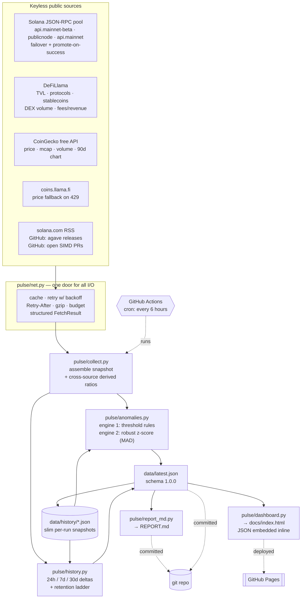

# Solana Ecosystem Pulse

**An auto-updating report on the state of the Solana ecosystem — network, validators, economics, ecosystem growth and anomalies — built entirely from public, keyless data.**

🔗 **Live dashboard: https://antheducation.github.io/solana-ecosystem-pulse/**
📄 **Latest report: [REPORT.md](REPORT.md)** · 🗃️ **Machine-readable: [data/latest.json](data/latest.json)**

[](https://github.com/antheducation/solana-ecosystem-pulse/actions/workflows/update.yml)
[](LICENSE)


---

## What this is

Three outputs, regenerated end-to-end every six hours from one command:

| Output | What it is |
|---|---|
| [`docs/index.html`](docs/index.html) | An interactive dashboard — dark by default, light on a toggle. Self-contained: it works identically from GitHub Pages, from `file://`, or out of a zip on a plane. No CDN, no build step, no chart library. |
| [`REPORT.md`](REPORT.md) | The same run as a human narrative — headline table, anomaly table, and a section per domain, with every caveat written down. |
| [`data/latest.json`](data/latest.json) | The full snapshot, versioned schema, ~160 KB. Everything the other two outputs render, plus the collection log. |

Plus [`data/history/`](data/history) — a slim snapshot per run, which is what makes week-over-week deltas and statistical anomaly detection possible.

## Install and run

```bash
git clone https://github.com/antheducation/solana-ecosystem-pulse.git
cd solana-ecosystem-pulse
python run.py
```

That is the whole setup. **No `pip install`. No `.env`. No API key. No account anywhere.** Python 3.9 or newer and an internet connection are the only requirements; everything else is the standard library. A full run takes about 15–20 seconds and makes ~35 HTTP calls.

```
python run.py --help
  --out DIR       write outputs somewhere other than the repo root
  --no-history    skip writing a history snapshot (useful for dry runs)
  --sigma 3.0     z-score threshold for statistical anomaly detection
  --quiet         only print the summary
```

Then open `docs/index.html` in any browser — double-click it; there is no server to start.

## Architecture



### Repository layout

```
run.py                     one entrypoint, no required arguments
pulse/
  net.py                   the only module that touches the network
  collect.py               orchestration + cross-source derived figures
  anomalies.py             two detection engines, one severity vocabulary
  history.py               snapshots, retention ladder, delta windows
  report_md.py             Markdown renderer
  dashboard.py             HTML + SVG renderer (no chart library)
  sources/
    rpc.py                 Solana JSON-RPC pool and on-chain collectors
    defillama.py           TVL, protocols, stablecoins, DEX volume, fees
    coingecko.py           SOL market data + keyless fallback
    news.py                RSS, Agave releases, open SIMDs, roadmap loader
data/
  latest.json              current snapshot
  roadmap.json             curated milestone list (dated, human layer)
  history/                 slim per-run snapshots
docs/
  index.html               the dashboard
  data/latest.json         the snapshot, served next to the dashboard
.github/workflows/update.yml
```

## Data sources and how they are integrated

Every source below is free to call, requires no key, no header and no signup, and is fetched through the single client in `pulse/net.py`.

| Source | Endpoint(s) | What it gives us | Cadence |
|---|---|---|---|
| **Solana JSON-RPC** | `api.mainnet-beta.solana.com`, `solana-rpc.publicnode.com`, `api.mainnet.solana.com` | `getHealth`, `getVersion`, `getEpochInfo`, `getSlot`, `getBlockHeight`, `getBlockTime`, `getRecentPerformanceSamples`, `getVoteAccounts`, `getSupply`, `getInflationRate`, `getRecentPrioritizationFees`, `getBalance`, `getSignaturesForAddress`, `getBlock` | live, every run |
| **DeFiLlama** | `api.llama.fi/v2/chains`, `/v2/historicalChainTvl/Solana`, `/lite/protocols2` | chain TVL + rank + 400-day history; 320+ Solana protocols with per-chain TVL, categories, tokenised assets | ~hourly upstream |
| **DeFiLlama stablecoins** | `stablecoins.llama.fi/stablecoincharts/Solana` | stablecoin supply on Solana, per-peg breakdown, history | daily upstream |
| **DeFiLlama dexs / fees** | `api.llama.fi/overview/dexs/solana`, `/overview/fees/solana` (`dailyFees`, `dailyRevenue`) | DEX volume 24h/7d/30d + daily series; chain fees and retained revenue (the REV inputs) | daily upstream |
| **CoinGecko (free)** | `api.coingecko.com/api/v3/coins/solana`, `/market_chart` | SOL price, market cap, FDV, volume, ATH, 24h/7d/30d/1y changes, 90-day daily chart | live, cached 5 min |
| **DeFiLlama coins** | `coins.llama.fi/prices/current`, `/batchHistorical` | price fallback when CoinGecko rate-limits a shared runner IP | on failure only |
| **Solana Foundation** | `solana.com/news/rss.xml` | ecosystem and community news | as published |
| **GitHub (keyless)** | `api.github.com/repos/anza-xyz/agave/releases` | validator client releases — the real upgrade signal | as published |
| **GitHub (keyless)** | `.../solana-improvement-documents/pulls?state=open` | the live SIMD proposal queue | as published |
| **Curated** | `data/roadmap.json` | named milestones (Alpenglow, Firedancer, SIMD-0228 …) with a visible `last_reviewed` date | reviewed by hand |

**How they hold together.** Every call goes through one client that adds a polite User-Agent, a timeout, gzip, an on-disk cache with per-call TTL, exponential backoff with jitter, and `Retry-After` handling on 429. Each call returns a structured result rather than throwing, and each result is logged — so **a failing source degrades the report instead of breaking the run**, and the dashboard footer and `REPORT.md` both show exactly which calls succeeded, which failed, and why. The RPC layer goes further: a pool of three keyless endpoints with per-method failover, and the endpoint that answers gets promoted to the front of the queue for the rest of the run.

### Metrics collected

**Network** — TPS (total and non-vote/"user"), 60-minute TPS series, slot time (avg/worst/series), block height, absolute slot, epoch and progress, slots remaining, agave version and feature set, inflation rate, per-endpoint RPC health and latency.

**Validators & stake** — active vs delinquent counts, delinquent share by count *and* by stake, total/active/delinquent stake, top 15 validators by stake with share and commission, Nakamoto coefficient, top-10 and top-33 stake shares, commission median/mean/distribution, count at 0 % and at 100 %, a delinquent sample.

**Economics** — SOL price, market cap, FDV, 24h volume, volume/mcap, ATH and distance from it, 24h/7d/30d/1y changes; TVL with rank among all chains and share of all tracked chain TVL; stablecoin supply and per-peg split; DEX volume 24h/7d/30d; chain fees and revenue (REV) with the revenue share; base fee, median and p75 priority fee, share of slots carrying one, and a modelled 200k-CU transaction cost in SOL and USD.

**Ecosystem growth** — 320+ Solana protocols by TVL, TVL by category, top-5 concentration, tokenised real-world assets and equities (BlackRock BUIDL, xStocks, Ondo …) as a category subtotal, and an address-activity proxy: unique fee payers per sampled block with the inter-block overlap rate.

**News & upgrades** — Solana Foundation news, Agave releases, the live open-SIMD queue, and the curated milestone list.

**Derived (cross-source)** — figures that exist only because two independent sources were collected in the same run: value of staked SOL, stake rate vs total supply, TVL/market-cap, stablecoin supply per dollar of DeFi TVL, DEX turnover ratio, annualised fees vs market cap, chain fees per user transaction, and estimated daily user transactions.

## Automation strategy

**In one line:** a cron-triggered GitHub Actions workflow runs the same `python run.py` you would run locally, commits whatever changed, and redeploys Pages.

- **Schedule.** `.github/workflows/update.yml` runs on `cron: "0 */6 * * *"` — every six hours — plus `workflow_dispatch` for a manual run and on every push to `main`. Change one line in the workflow to change the cadence; nothing else knows about the schedule.
- **Idempotent.** A run reads no state except `data/history/`. Running it twice in a row is safe and produces two valid snapshots.
- **Self-healing.** Rate limits are expected, not exceptional: RPC fails over across three endpoints, CoinGecko falls back to DeFiLlama, and the whole run carries a wall-clock budget (`PULSE_RUN_BUDGET`, default 900 s) so no hung endpoint can wedge the schedule.
- **Low-maintenance by construction.** No dependency to update, no key to rotate, no service to keep alive. The one file a human ever needs to touch is `data/roadmap.json`, and it carries a `last_reviewed` date so staleness is visible in the output rather than silent.
- **Honest failure.** The run exits non-zero only if *every* source failed. Partial failures are reported in all three outputs.
- **Retention.** History keeps everything from the last 14 days, then one snapshot per day out to 180 days, then one per week for ever — so the repo stays small while trend data keeps accumulating.

Tunable via environment variables: `PULSE_CACHE_TTL`, `PULSE_CACHE_DIR`, `PULSE_HTTP_TIMEOUT`, `PULSE_RUN_BUDGET`.

## Anomaly detection

Two engines, one severity vocabulary (`info` · `warning` · `serious` · `critical`), rendered identically in HTML, Markdown and JSON.

**Engine 1 — threshold rules.** These fire from a single snapshot, so the report is useful on its very first run. They encode what "unhealthy" means on Solana specifically:

| Rule | Fires when |
|---|---|
| `tps_floor` | avg TPS < 1,500 (serious) or < 800 (critical) |
| `tps_spike` | window peak > 2.5× the window average |
| `low_user_share` | non-vote TPS < 10 % of total throughput |
| `slot_time` | avg slot time > 500 / 600 / 800 ms against the 400 ms target |
| `slot_time_worst` | any 1-minute bucket averages > 1,000 ms per slot |
| `validator_delinquency` | delinquent **stake** ≥ 2 % (serious) or ≥ 5 % (critical) |
| `validator_delinquency_count` | ≥ 10 % of validators not voting |
| `stake_concentration` | Nakamoto coefficient < 20 |
| `rpc_health` | any / all public endpoints fail `getHealth` |
| `price_move` · `tvl_move` · `stablecoin_move` · `dex_move` · `fee_move` | 24-hour move past a per-metric band (SOL ±8/15 %, TVL ±6/12 %, stablecoins ±3/6 %, DEX and fees ±40/70 %) — read from each source's *own* change field, so large moves are caught on run one |
| `client_version` | the answering node is running a release candidate |

**Engine 2 — robust z-score.** Once `data/history/` has five or more runs, eleven tracked metrics get a **median/MAD** z-score rather than a mean/σ one — so a single earlier spike cannot blind the detector to the next. Anything past 3σ (configurable with `--sigma`) is reported with its current value, the historical median, the sigma distance and the percentage gap. Tracked: TPS, non-vote TPS, slot time, active and delinquent validators, TVL, SOL price, stablecoin supply, DEX volume, chain fees, median priority fee.

A rule that throws is caught and reported as an `info` finding — a broken detector never breaks the report.

## How to read the outputs

- **Status banner / `Network status:` line** — the worst severity present. `HEALTHY` means every threshold rule passed *and* nothing exceeded its z-score band.
- **Hero + tiles** — the headline state. Deltas are labelled with their window (24h, 7d).
- **Charts** — the filter row above them scopes every historical chart at once (30d / 90d / 180d / All). Every chart has a **Table** toggle showing the same numbers as text: colour never carries meaning alone, and a tooltip never hides a value you cannot otherwise reach. Axes that start at zero say so in the caption; the SOL price chart is padded to its range instead, and says that too.
- **Anomalies** — each finding names its engine (`threshold` or `zscore`) so you can tell a fixed rule from a statistical one.
- **`REPORT.md`** — the same run in prose, ending with a per-source table and, if anything failed, a collapsible list of the failed calls.

## Design notes

The dashboard is hand-built SVG with no charting library, which is why it is self-contained and has no supply chain. It follows a validated categorical palette: series colours are stepped separately for the dark and light surfaces (not flipped), the adjacent-pair contrast was machine-validated for deuteranopia/protanopia/tritanopia separation rather than eyeballed, status colours are reserved and always ship with an icon *and* a label, marks are thin with hairline gridlines, and every chart has a table twin. Charts re-render on resize and on theme change so nothing is baked to one viewport.

## Limitations — stated plainly

- **Dune Analytics is not used.** Dune's API requires a key, which contradicts the "no API keys" preference this project is built around. Every metric a public Solana Dune dashboard shows — TVL, DEX volume, fees/REV, stablecoin supply, active addresses — is sourced here from keyless equivalents instead.
- **Twitter/X is not used.** No keyless read path has existed since free v2 reads closed. Announcement flow is covered instead by the Solana news RSS, the Agave release feed and the live SIMD queue — arguably better signals for what is actually shipping.
- **"Daily active addresses" is a proxy, not a count.** A true daily-unique-address figure needs an indexer. What a public RPC can give honestly is the unique fee-payer count inside specific blocks, so that is what is reported — with the inter-block overlap rate, and labelled as a proxy everywhere it appears.
- **REV is a proxy.** It is DeFiLlama's chain-level fee figure for Solana. Strict REV (base fees + priority fees + MEV tips) needs block-level accounting no keyless endpoint publishes. The definition travels with the number in all three outputs.
- **The typical transaction fee is modelled, not observed.** The base fee (5,000 lamports) is exact and the median priority fee is observed; combining them for a 200k-CU transaction is a model, and is labelled as one.
- **Per-protocol TVL sums higher than chain TVL.** DeFiLlama strips double-counted value (liquid-staking tokens redeposited as collateral, etc.) from chain totals but reports it in each protocol's own figure. Both numbers are correct; they answer different questions. The report says so where both appear.
- **Public RPC is best-effort.** `getSupply` in particular is refused by some public endpoints; when every endpoint refuses, the field is reported as unavailable rather than guessed.
- **Tokenised assets are measured as locked value, not traded volume.** No keyless source publishes per-venue tokenised-equity volume.
- **The milestone list is curated.** `data/roadmap.json` is the one hand-maintained file, and it carries its review date into the output.
- **CoinGecko rate-limits shared IPs.** On a busy runner the price may come from the DeFiLlama fallback; the output records which provider answered.

## License

MIT — see [LICENSE](LICENSE).
